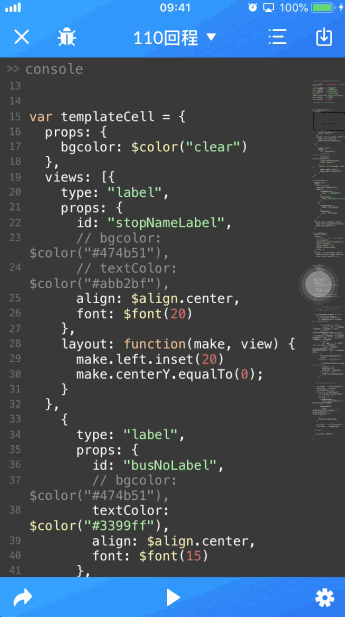
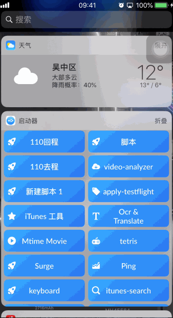
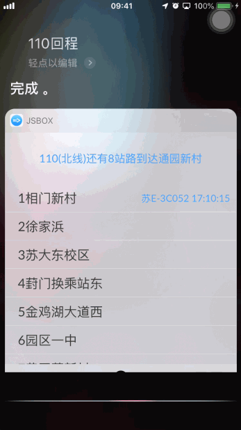

# 介绍

对于一个公交通勤的码农，日常查公交线路已经成为常规操作。在苏州的朋友可能会知道，查询各路公交有个专门的微信公众号【今日苏州公交】。需要查询的时候，就得
```
1.先打开微信；
2.找到公众号；
3.点击公众号第二个tab“公交查询”呼出菜单；
4.再点开“公交实时查询”的菜单按钮，才能打开查询的网页；
5.输入要查询的公交线路；
6.点击搜索出的结果；
```
经历这繁琐的6步，才能查询到你想要的那一路公交运行到哪里，还有几站路能到达。

使用这个脚本+JSBox，你可轻松以实现一键查询你想要的公交信息。

# 运行环境

- iOS 12.0+
- JSBox 
- 捷径（可选）

JSBox是个很强大的app，可玩性很高，一个创造工具的工具, 具体了解可以点击[这里](https://sspai.com/post/42361)
https://itunes.apple.com/cn/app/jsbox/id1312014438?mt=8 App Store价格为50RMB。


# 最终效果
有好几种运行方式：

1.直接在JSBox中运行：


2.在widget里运行（推荐）:


3.使用Siri唤起执行（推荐）:


4.使用Siri执行带JSBox的捷径（推荐）：


5.点击图标运行（比较推荐）:


# 使用方法
  
  推荐使用VSCode来编辑脚本，有专门的插件，能实现手机上在线编辑调试，自行查阅JSBox官方文档。
  
  如果你也在江苏省苏州市,你只需要修改config部分的参数即可；
  
  ```
  /******* config ***********/

  var stopID    = 10002145; // 通园新村id
  var stopName  = "通园新村";
  var lineID    = "10000570";
  var busName   = "110(北线)";
  
  ```
  
  那么如何获得这些参数呢。你需要自己用Charles抓包工具，连接真机抓包。打开【今日苏州公交】微信公众号，搜索你想要的公交线路id，以及你想要的公交站id，就可以了。
  比如：
  
  ```
  查询线路站点信息
  路径： http://app.2500.tv/bus/api_line_status.php
  请求方式：POST
  参数：lineID 
  110南线id 10000522

  返回
    {
      "status":1,
      "data":[
        {
            "BusInfo":"",
            "Code":"ADU",
            "ID":10003883,
            "InTime":"",
            "OutTime":"",
            "StationCName":"星塘公交中心"
        },
        ...
        ]
    }

  ```
  
  不在苏州的朋友，就请自行查阅你所在地相关的微信微博网站，找一找类似的接口，再根据接口json调整字段即可。
  
# 相关文章

简书：https://www.jianshu.com/p/7d77533e7ca3 

掘金：https://juejin.im/post/5c51766ee51d4539f51db027

个人博客：http://www.akpop.top/2019/01/30/Bus_JSBox/

# License

This project is released under the Apache License 2.0 license. See the [LICENSE file](LICENSE) for more info.
